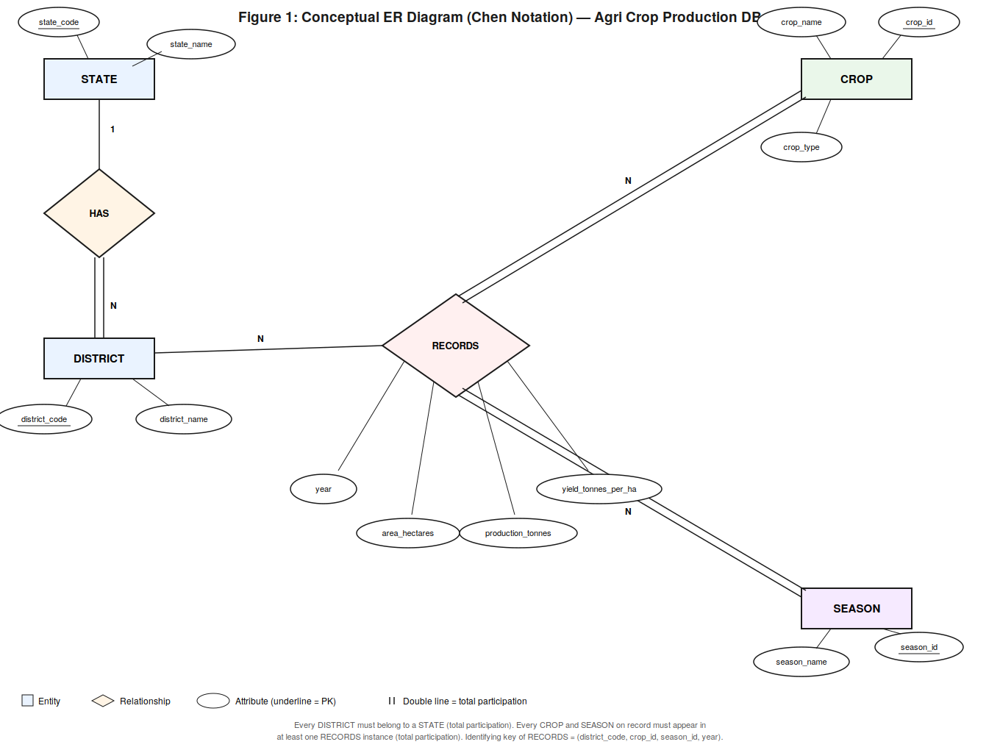
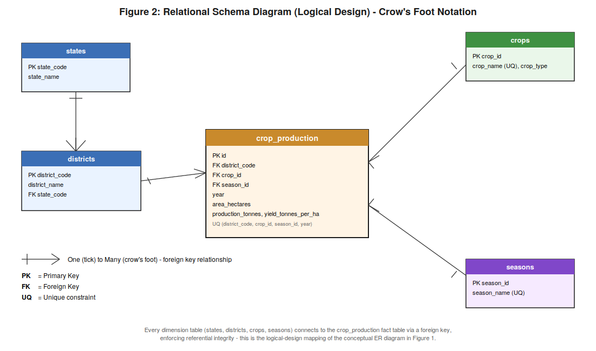

# Indian Agriculture & Crop Production Database

A normalized MySQL database and analytics project built on real Government of India agricultural data — covering 27 years, 34 states, 740 districts, and ~455,000 production records.

## Overview

This project models, loads, and queries India's district-level crop production data (1997–2023), sourced from the Ministry of Agriculture & Farmers Welfare via [data.gov.in](https://data.gov.in). Rather than using a synthetic dataset, this project works with real government open data — which surfaced a genuine data-quality issue (see [Key Findings](#key-findings)) that had to be diagnosed and fixed, not just assumed away.

## Features

- **Normalized 3NF relational schema** — 4 dimension tables + 1 fact table, justified with a full 1NF → 3NF walkthrough
- **Automated Python ETL pipeline** — cleans, deduplicates, and batch-loads ~455K records with proper NULL handling
- **21 SQL queries** spanning basic retrieval to subqueries and `EXISTS` clauses
- **Conceptual ER diagram** (Chen notation) modeling the fact table as a proper ternary relationship
- **Logical schema diagram** (crow's-foot notation) showing the physical foreign-key design

## Tech Stack

| Component | Choice |
|---|---|
| Database | MySQL 8.0 |
| ETL / Automation | Python 3 (pandas, mysql-connector-python) |
| Data Source | [data.gov.in](https://data.gov.in) — Area, Production, Yield (APY) dataset |
| Documentation | Markdown, Word |

## Entity-Relationship Diagram



`STATE` (1) — has — (N) `DISTRICT`. `DISTRICT`, `CROP`, and `SEASON` jointly participate in the ternary relationship `RECORDS`, whose attributes (year, area, production, yield) describe each individual production record.

## Relational Schema



```sql
states(state_code PK, state_name)
districts(district_code PK, district_name, state_code FK)
crops(crop_id PK, crop_name, crop_type)
seasons(season_id PK, season_name)
crop_production(id PK, district_code FK, crop_id FK, season_id FK,
                 year, area_hectares, production_tonnes, yield_tonnes_per_ha)
```

## Dataset

| Attribute | Detail |
|---|---|
| Source | Ministry of Agriculture & Farmers Welfare, Govt. of India |
| Coverage | 1997–2023, 34 states/UTs, 740 districts |
| Size | ~455,000 production records |
| License | Open Government Data License – India |

> The raw CSV is not committed to this repo due to size (~53MB). Download it directly from [data.gov.in](https://data.gov.in) or the [India Data Portal](https://indiadataportal.com) — see `data/README.md` for the exact source link.

## Project Structure

```
agri-crop-db/
├── schema/
│   └── 01_create_tables.sql       # DDL for all 5 tables
├── scripts/
│   └── load_data.py               # ETL pipeline: CSV -> MySQL
├── queries/
│   └── analysis_queries.sql       # All 21 queries, basic -> advanced
├── diagrams/
│   ├── chen_er_diagram_v2.png     # Conceptual ER diagram
│   ├── relational_schema_diagram.png  # Logical schema diagram
├── data/                          # (gitignored) place raw CSV here
├── report/
│   └── DBMS_Lab_Project_Report.docx   # Full project report
└── README.md
```

## Setup & Usage

1. **Clone the repo**
```bash
   git clone https://github.com/DevSheta07/agri-crop-production-db.git
   cd agri-crop-production-db
```

2. **Create the database and tables**
```bash
   mysql -u root -p -e "CREATE DATABASE agri_crop_db;"
   mysql -u root -p agri_crop_db < schema/01_create_tables.sql
```

3. **Download the dataset** into `data/crop_production_raw.csv` (see [Dataset](#dataset))

4. **Install dependencies and run the loader**
```bash
   pip3 install pandas mysql-connector-python
   MYSQL_PASSWORD=your_password python3 scripts/load_data.py
```

5. **Run the queries**
```bash
   mysql -u root -p agri_crop_db < queries/analysis_queries.sql
```

## Key Findings

While building the ETL pipeline, `crops.crop_code` — initially assumed to be a unique identifier — turned out to map to **up to 7 different crop names for a single code**. This was caught by comparing `nunique()` counts on `crop_code` (94) vs. `crop_name` (115) in the raw data, and led to redesigning the `crops` table around a surrogate key (`crop_id`) with `crop_name` as the true unique field. This is documented in full in the project report under Testing & Evaluation.

## Author

**Dev Sheta**
B.Tech CSE, Pandit Deendayal Energy University (PDEU)

## License

Data used under the Government of India's Open Government Data License. Code in this repository is available under the MIT License.
